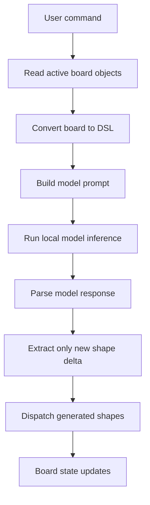
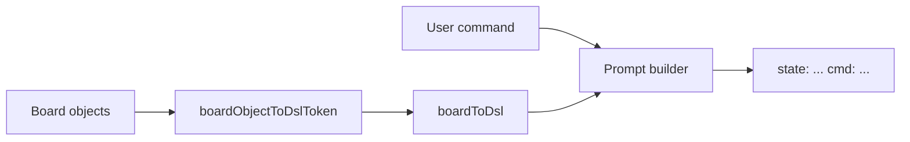
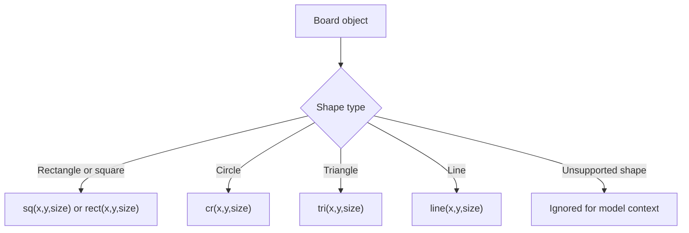
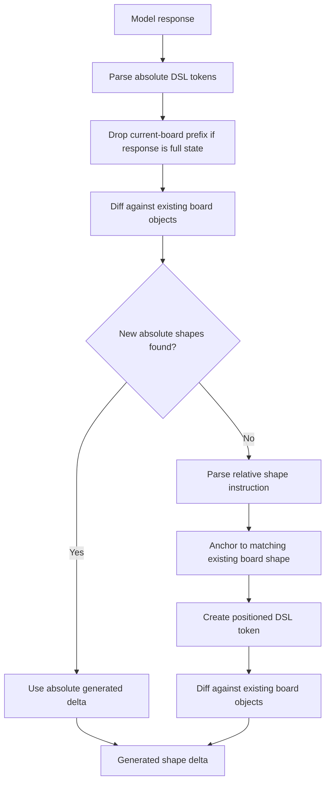
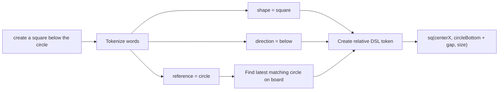
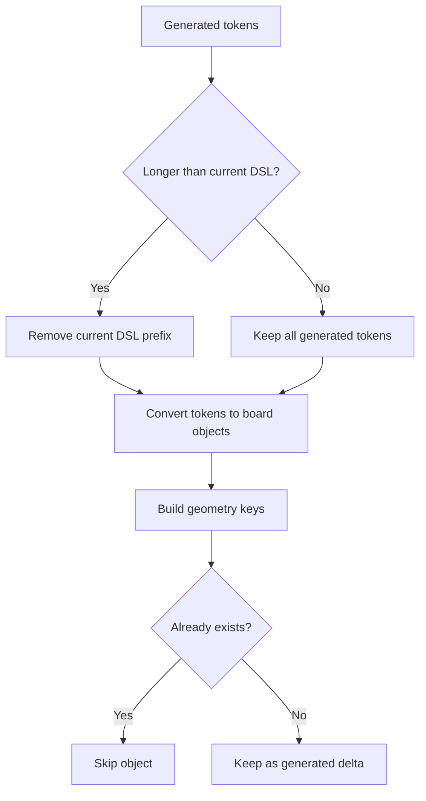
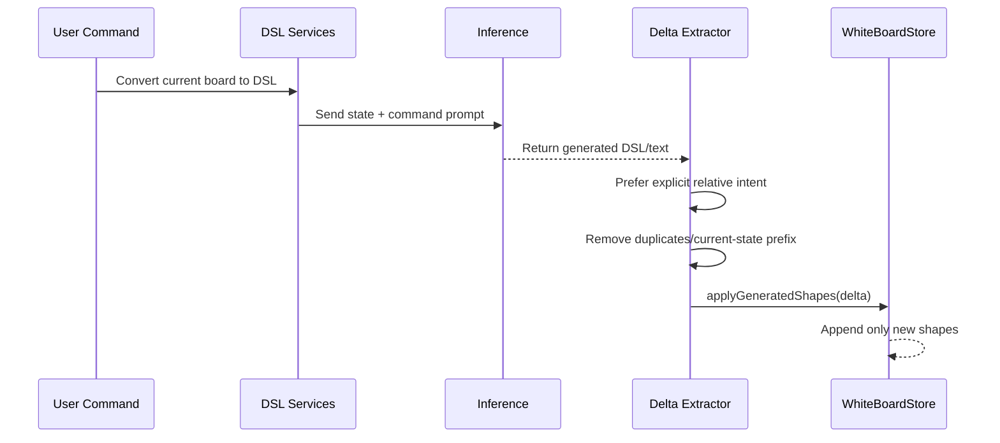

# Geometric Model Workflow

This document explains the application-side workflow that connects user input to the geometric model and converts the model response into whiteboard shapes. It intentionally skips the chat window UI and Playwright debug setup.

## High-Level Flow

The model is treated as a shape-planning engine. The app converts the current board into a compact geometric DSL, sends that DSL plus the user's command to the model, then validates and applies only the new shapes.



## Input To Prompt

The input side starts with two pieces of information:

- The current board object list.
- The user's command, for example: `create a square below the circle`.

The board is serialized by `boardToDsl()` into compact tokens:

```text
sq(80,120,60) cr(120,260,42)
```

The model prompt is then built as:

```text
state: sq(80,120,60) cr(120,260,42) cmd: create a square below the circle
```



## DSL Shape Mapping

The DSL keeps the model contract small. The app maps supported board shapes to model-friendly token kinds.



The parser reads model output with the same token grammar:

```text
sq(100,340,60)
cr(220,180,40)
tri(80,90,60)
```

## Model Response Processing

The model may return either:

- Absolute DSL tokens, such as `sq(100,340,60)`.
- A full board state that repeats existing shapes plus new shapes.
- Relative natural-language instructions, such as `square below circle`.

The app normalizes these through `diffGeneratedDslState()`.



## Relative Placement Handling

Relative placement is used when a command or response says things like:

- `square below circle`
- `circle right of rectangle`
- `triangle above square`
- `shape near circle`

The app extracts:

- The shape to create.
- The direction.
- The reference shape, when present.

Then it computes the new shape position from the reference object's bounds.



This lets explicit user intent override bad model coordinates. For example, if the model returns a square at the wrong absolute position but the user's command says `below the circle`, the app uses the command's relative placement intent first.

## Duplicate Prevention

The model often returns the full desired board state, not just the new objects. To avoid duplicating existing shapes, the app performs two checks:

1. If the generated token list starts with the same number of tokens as the current board context, that prefix is treated as existing context and removed.
2. The remaining generated objects are compared against existing board objects using a normalized geometric key.



## Board Update

Only the final generated delta is sent to Redux through `applyGeneratedShapes()`.



## Key Files

- `v3/src/Services/GeometricModel/boardToDsl.ts`: Converts board objects into compact model context.
- `v3/src/Services/GeometricModel/dslParser.ts`: Parses absolute model DSL tokens.
- `v3/src/Services/GeometricModel/dslToBoard.ts`: Converts parsed DSL tokens into board objects.
- `v3/src/Services/GeometricModel/diffStates.ts`: Extracts new shapes, prevents duplicates, and handles relative placement.
- `v3/src/Components/ChatPanel/index.tsx`: Connects command submission to the model and dispatches generated shape deltas.

